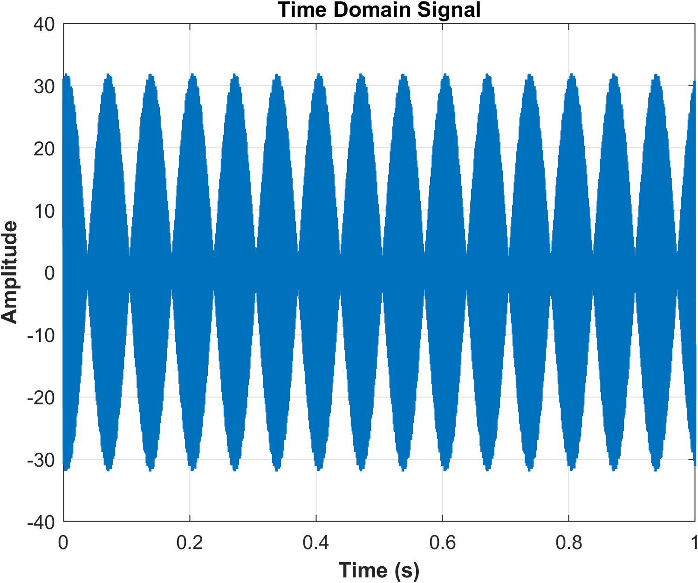
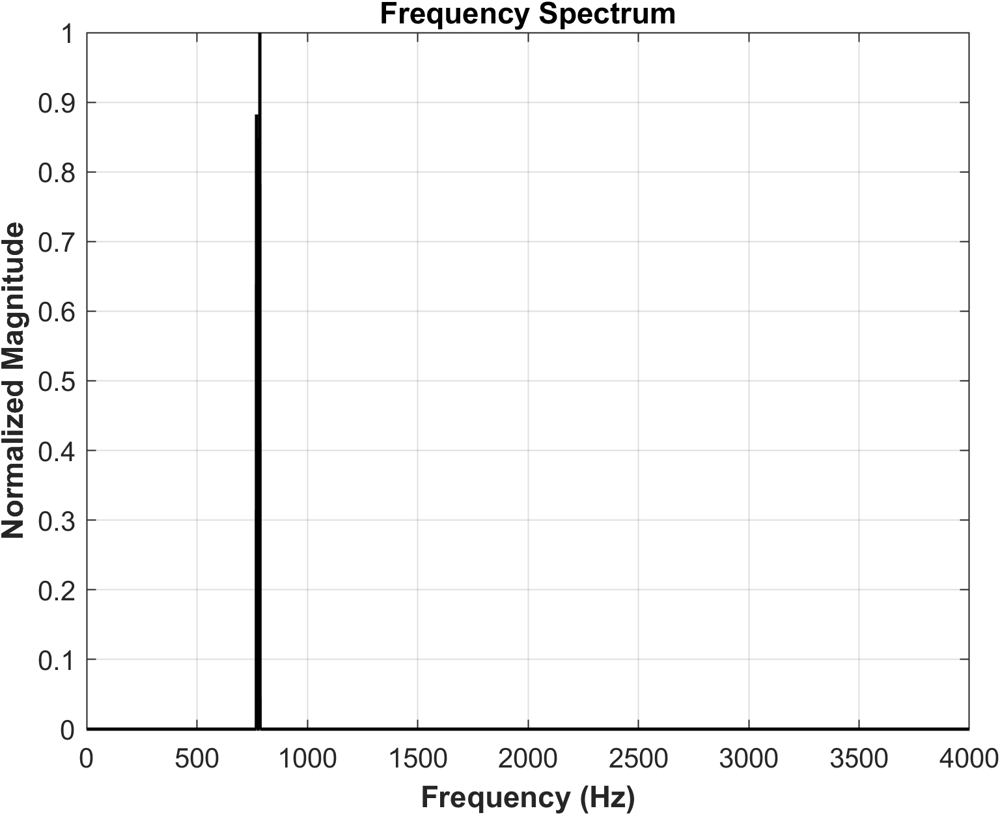
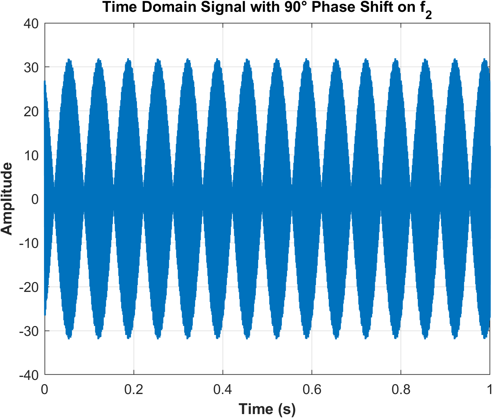
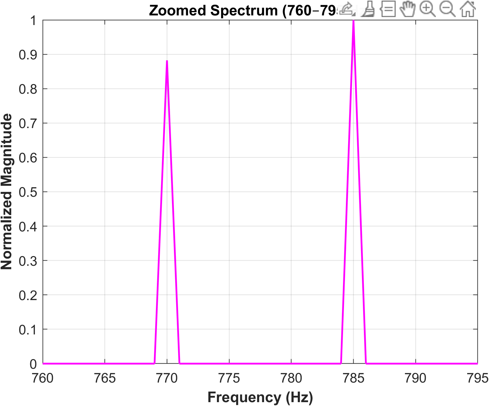

# 📊 Time and Frequency Domain Analysis (MATLAB/Octave)

A project demonstrating time and frequency domain analysis of signals using MATLAB/Octave.  
Implements FFT-based analysis, spectral visualization, and signal reconstruction.

---

## 🚀 Features
- Time-domain signal generation and visualization  
- Frequency-domain transformation using Fast Fourier Transform (FFT)  
- Magnitude and phase spectrum plots  
- Noise addition and filtering demonstration  
- Signal reconstruction using inverse FFT  

---

## 💻 Technologies
- MATLAB / Octave  
- Signal Processing Toolbox *(optional)*  

---

## 📈 Example Output

| Time Domain | Frequency Domain |
|--------------|------------------|
|  |  |
|  |  |

---

## 🧠 Concepts Covered
- Continuous vs. discrete-time signals  
- Fourier Transform theory  
- Spectral leakage and windowing  
- Signal energy and power analysis  
- Phase relationships and interference  

---

## 🪪 License
Released under the MIT License.  

**Author:** [Gideon Odutayo](https://www.linkedin.com/in/gideon-odutayo-4486912b2/)  
**GitHub Repository:** [TimeFrequencyDomainAnalysis](https://github.com/Giddywiddit/TimeFrequencyDomainAnalysis)

---
